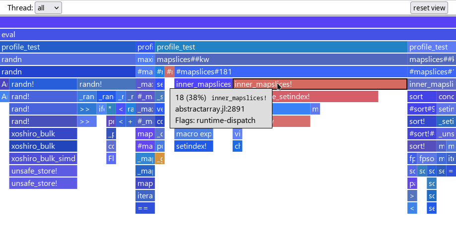
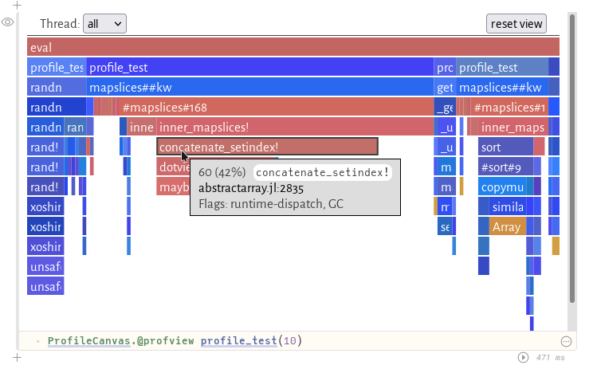

# ProfileCanvas [](https://github.com/pfitzseb/ProfileCanvas.jl/actions/workflows/CI.yml) [](https://juliahub.com/ui/Packages/ProfileCanvas/T2dXl)

This package is intended as a drop-in replacement for [ProfileView.jl](https://github.com/timholy/ProfileView.jl) and [ProfileSVG.jl](https://github.com/kimikage/ProfileSVG.jl).

It exposes the HTML canvas based [profile viewer UI](https://github.com/pfitzseb/jl-profile.js) used by the [Julia extension for VS Code](https://www.julia-vscode.org/docs/stable/userguide/profiler/) in the REPL and environments that can display HTML (like Pluto notebooks). Performance should be significantly better than SVG-based solutions, especially for very large traces.

## Usage

```julia
using ProfileCanvas
function profile_test(n)
    for i = 1:n
        A = randn(100,100,20)
        m = maximum(A)
        Am = mapslices(sum, A; dims=2)
        B = A[:,:,5]
        Bsort = mapslices(sort, B; dims=1)
        b = rand(100)
        C = B.*b
    end
end

@profview profile_test(1)  # run once to trigger compilation (ignore this one)
@profview profile_test(10)
```
results in



when run from the REPL and



in a [Pluto](https://github.com/fonsp/Pluto.jl) notebook.
